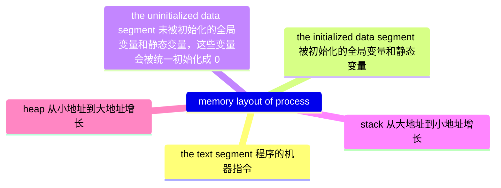

### 前言

日子过得真快，距上一次发表[年终总结](https://guo-sj.github.io/summary-of-year/2022/01/31/2021-summary.html)，已经两年过去了。因为身体的缘故，
2022 年的总结没有写，本来想直接写 2023 年的总结，但是一想，“2021 年终总结，接下来就是 2023 年终总结？”，以后自己读起来会不会感到奇怪？本着对自己
负责的态度，这篇博客就把 2022 和 2023 一起写了吧。

### 2022 年干了什么

2022 年上半年，我在富士通和鸡哥做分布式存储系统[seaweedfs](https://github.com/seaweedfs/seaweedfs)，它也是我在 github 第一个提 PR 的开源项目。
目前为止我一共给它提交了 25 个 commit，排名第 12 位，大部分都比较水，哈哈。

此外上半年我还在准备人生中的第一个跳槽，我重新学习了数据结构和算法，在 leetcode 和牛客网上练习了一些算法题，也面试了几家公司，最终于当年 9 月
1 日入职了华为 OD，并将整个面试过程写成了[博客](https://guo-sj.github.io/interview/2022/07/10/huawei-interview.html)。

接下来就是在华为的事情了。初入华为南京研究所，给我的第一感受就是“这里像个大学”。这里有巨大的食堂，专门一栋楼（N5）用于培训和讲座，免费的健身房，
公园般的园区环境， 再加上身边的同龄人很多，大多来自于东南，南大或者其他国内外名校，让我这个离开学校 3 年的人重新找回了一丝在大学的感觉。

第二个感受就是工作强度真的有点大。大家大多都是 11 点之后下班，项目紧的时候到凌晨一两点也是可以的。有时候我就有一种错觉，就感觉这不是在工作，
而是在守岁，两者非常相似。一群人共同朝着一个目标去努力，然后一起在一个地方待到 12 点，这不就跟守岁一模一样吗？

### 2023 年干了什么

到了 2023 年，还是从华为的生活开始说起。华为新员工需要考可信考试。可信考试是对员工软件能力的一种认可，根据难易程度分为入门级，工作级和专业级。
新员工（华为新员工的定义是未满 6 个月的员工）需要通过入门级才可以正式转正，我所在的部门一般要求要专业级。加上通过专业级也是 OD 转华为的必要条件，
所以一进公司，我就努力学习可信知识，准备专业级 4 个科目的考试。最终在 2023 年 2 月 10 号拿到 C 语言专业级认证，耗时 5 个月 10 天。

简单说下这个考试对我的意义。科目一是上机编程，共 3 道题，用 leetcode 的难度标准是两道中等和一道困难。这部分没有什么说的，掌握常见的数据结构
和算法，刷足够多的题目，对于 C 语言来说，因为没有现成的 hash 库，所以建议把 [uthash](https://github.com/troydhanson/uthash) 的用法掌握。

科目二是考查 C 语言的语法知识，还存在一些各种稀奇古怪的知识点。整个备考过程除了让我对 C 语言的 murkier corner 有一些了解之外，更多是使
我对 C 语言的相关知识进行了系统化的巩固和提高，尽管我在前公司已经做了 2 年的 C 语言开发了，自以为对 C 语言掌握的足够全面了，在备考过程
中还是学到了很多新知识，如一个进程的内存结构分为哪几部分，虚拟内存和物理内存概念和关系，什么是可重入（Reentrancy）等等。

科目三开卷，考的比较杂，略过。

最后是科目四。这个科目加深了我对软件开发的理解，它主要考察的是设计模式（Design Pattern）。设计模式简单理解就是软件设计模板，
开发软件的第一步是做软件设计，设计的时候你需要根据需求考虑使用一种或多种的设计模式，常见的设计模式有抽象工厂模式，外观模式等。这些观念让我感到
相见恨晚。因为它们一听就是我需要的东西。我的目标是成为一个大型软件架构师，可以设计并实现出世界一流的商业软件，简单的逻辑堆砌或者是数据结构和算法是
无法支撑实现这个目标的，我需要学习更加高阶更加抽象的理论。而设计模式就是我苦苦寻找的东西。目前这部分我只是见识过，还没有认真开始学习。不过我已经买了
《设计模式的艺术》这本书，在 2024 年开始学习。

除了考试，我在工作中还认识了不少有趣的人。

首先是张旭，上海交大的本科生，之前在南京国家电网工作过，跟我一样在这里当 OD。上半年我负责项目开发的时候，他负责项目管理。我是第一次自己独立负责
一个需求，他则是第一次当 PM。那个需求做了 3 个月，不少时候两个人都是 12 点之后才离开公司，真的是一对难兄难弟。他去年全年的绩效是 A，只要今年上半
年的绩效是 A 的话就可以转成正式员工，但是很遗憾领导并没有给他 A。七月份的时候他家里出了点状况，加上绩效的事情，不久就离开了华为。后来我们俩还通
过一次电话，电话里说着，要一起约出来吃饭，一起出来玩什么的，但是现在到年底了，也没有约出来过。

另一个就是我师父孙立礼。一个在华为 16 年的老专家。今年在工作中，他救了我两次。**第一次是我对全局变量进行赋值，没有加锁，导致在多线程环境下出现非常奇怪
的错误**， 每次打的异常栈都不一样，根本无法定位。我师傅看了一眼我的代码，就说你是不是 C 语言的经验不太够，这个是最基本的常识，在多线程环境下，对全局变
量进行读 写操作，一定要加上锁，否则，一个线程 A 刚对这个变量读了一次，正准备读第二次，但此时另一个线程 B 把这个变量写掉了，A 再读的时候值就不对了，
这样当然
会导致程序问题。另一次是临近过点的时候来了一个问题单，说我有异常栈，我怎么看都看不出来是什么原因导致的。异常栈不是会把寄存器的值都打出来吗？还会把
函数名以及出问题语句的地址偏移打出来。我甚至想根据这个信息看哪一行出了问题，但是我又不会这样的操作，于是问题就僵住了，这个时候又找师父求助，
师父稍微看了一下我的代码，立刻就指出，你这个变量刚在外面释放，在函数里面的函数的里面的函数的里面的函数又用到了，这难道不会出问题吗？这个时候进程
是有可能崩溃的。当这个指针变量所指向的堆空间还在你当前的进程地址空间内时，读它是不会出问题的，顶多就是读取的值不对；写的话是会出问题的。而当这个地址
已经被别的进程占用的时候，无论是读写都会出问题，进而导致进程异常退出。因为在 Unix/Linux 环境中，是不允许跨进程访问地址空间的。经过他的指点，
我恍然大悟，原来是这样，于是我快速的把问题修正。对于师父这个人的技术能力，我是很认可的，我觉得他的能力是高出我们身边人，甚至身边的所有人都一大截，这
就是老技术专家的实力啊。这让我意识到，在 C 语言中，就算你 free 了，这个指针你还是可以继续访问它；如果它所指向的那块地址已经被被其他进程或者内核占用
的话，那么就会出现内存访问异常。

除了结识新朋友，一些老朋友因为我工作切换的原因，渐渐的没有了什么共同语言，也不再联系了。刘路和李先锋这两位在富士通的前同事，是自我进入社会认识的最好的
两位朋友，在公司的时候经常一起约饭聊天打台球，因为我在华为经常周末加班，自从二月份以来就没有再联系过，关系慢慢淡掉了。张冬青也是富士通的同事，是我
在云平台认识的，也喜欢读书，也喜欢《遥远的救世主》和根据它改编的电视剧《天道》，我们两个人也经常出来打台球。我们俩个约定是一月见一次，互相聊聊，上一次见面是十一放假前，到现在也有 3 个月了。

天下没有不散的宴席，朋友随着工作动很正常。人的一生中除了人形的朋友，还有另一类朋友 -- 书中的朋友。在这一年里，我也结识了不少书中的朋友。我读了王鼎钧
先生的“人生四书”，即《开放的人生》、《人生试金石》、《我们现代人》和《随缘破密》，王老用一个个小故事，给我阐述了他对于人生的理解，对于人性的洞察。
读 Brian Kernighan 的 《UNIX: A History and a Memoir》，了解 UNIX 和 Bell Labs 的历史，中文版翻译的很烂，建议读英文原版。读《狂飙》，很好看的小说，
用了 7 个小时一口气看完，但是听说电视剧比小说更加精彩。读 《The UNIX Programming Environment》，学习 ed，sed，grep 及 awk，及 shell 编程，最近在看
第八章，如何使用 yacc，lex 及 make 实现一个名叫 hoc 语言的编译器。

我对工作还有了更深的感悟。在华为工作的一年中，我在同期入职的人中表现并不是最突出的，或者说我没有达到我预期的效果。在发现这一现象后，我开始尝试寻找
原因。我首先做的是去观察那些取得良好绩效的人。在观察了一段时间后，我更加迷惑了，因为我发现他们啥也不会，与我相比，他们不懂开源，不懂 OS 和 shell
 script，甚至大部分人都不是计算机学院毕业的。那他们为什么会干得比我好呢？或者说，为什么我比他们多会那么多东西却干得不如他们呢？后来我发现，他们身上
都有一种特质，即他们都非常愿意为工作付出。在拿到一个任务后，他们就会想尽一切办法把事情做成领导期待的样子。有些任务都不涉及软件开发，只是些文档编辑
或者拉通对齐相关的事情，他们依然会做到全身心投入。这个我在工作中确实没有做到。我觉得我就是个程序员，为什么文档和接通对齐这些事情要我来做？它们对我的
技术水平一点提升都没有啊？但是渐渐的，这些人升的越来越快，领导对于他们也越来越重视。而看重技术的我却只能拿个中等绩效，被领导晾在一边。在观察到这一
现象后，我尝试用自己的知识来解释它：**在当前的评价体系中，领导只会欣赏干活又快又好的人。他们不会在乎这个活的内容到底是软件研发，文档编写还是接通对齐
，他们只想要一个结果。所以任何一个愿意为手头工作付出全部并取得好结果的人就会对领导赏识并获得提拔，这就是为什么那些知识不如自己的人可以成功的原因。**

好，我知道自己应该怎么做了，但是要我做到这一点，还有一个问题要回答：那些非软件开发的工作对于我自己到底有没有意义？我们可以尝试分析下这个问题：首先，
在当前的评价体系内这些工作是有意义的。高质量的完成它们取得的奖励就是它们的意义。把它们做好，我会受到领导的关注，取得更好的绩效，甚至因此升职加薪，
提升自己的物质水平。另外，这套评价体系在任何一家以赢利为目的的公司中都适用，所以只要按照这个标准去做，理论上无论在哪个公司自己都可以活得很好。OK，我
对自己的回答感到满意。Problem is solved。

现在我们解决了“干什么”的问题，接下来我们来看“怎么干”。关于这一点我已经有了答案，那就是：**在工作中不断的磨砺自己的能力**。我清楚，演习中产生不了
英雄，英雄只会在战役中涌现。我只有在工作中多干多想，多向高绩效人士学习，才可以切实的提升自己的工作能力和工作觉悟。原因是，自己工作的结果是直接和
自己给公司产生的利益相关，这个利益又直接和我的工资水平相关。也就是说，我做的工作给公司带来的实际收益一定是要大于等于自己从公司领取的薪水，
自己才可以在这家公司活下去。所以工作是一个真刀真枪的环境，自己的表现将直接决定自己是否在这家公司中存在。

写到这里，我又产生了一个疑问：别人已经跑在自己前面了，在追赶的过程中自己应该保持一种什么样的心态呢？唉，回想起来，自己一直就是个爱比较的人，上学的
时候比成绩，工作的时候比工资，啥都喜欢比，自己比别人优秀的时候担心别人把自己超过，自己不如别人的时候，又会焦虑该如何赶上别人。关于这个问题，我想
用今天走路时的冒出的一个觉悟回复下：这个世界唯一不变的就是变化。看路上的车子，开 Porsche 的人 5 年前可能还在开五菱，而开速腾的人上辆车可能是辆 S 级。
在外面这些年，自己见过不少踏实肯干的人通过自己的努力实现阶级跃迁，也见过一些老板从上亿身家沦落到跑网约车维持生活。或者，拿学习生活来说，不少高考不如
自己的同学在考研时考取了名校，而自己因为考研失败现在只是个本科文凭。作为一个社会人，我们要认识到这一点，**先发制人有先发制人的好处，后起之秀有后起之秀
的优势。在我领先的时候，要清楚世事无常，努力做好每一件事；在落后的时候，只要踏实的把每一步走好，慢慢的就会走出复利，这是自己唯一的机会**。

哦，对了，还有一件事！今年对我和我对象来说是一个非常重要的年份，我们俩在南京领了[结婚证](https://guo-sj.github.io/marry/2023/09/03/marry.html)，在托
乐嘉买了房子也快装修好了，明年上半年就可以住进去，算是在南京定下来了。

### 2024 年打算干点什么

讲完了 2023 年，我来写写 2024 年的一些规划。首先是要维持身体健康，要清楚：**自己健康时的梦想有无数个，而生病时的梦想只有一个，那就是健康**。坚持做
深蹲，增加腿部肌肉和腰部肌肉的强度。个人感觉还是先练习自重深蹲，等自重可以练到 50 * 3 的时候，再尝试负重深蹲。睡觉前按摩眼部肌肉，缓解眼部疲劳，
提升睡眠质量。还有一点是坚持羽毛球投资不动摇，看看在教练的指导下坚持学习一年，自己的羽毛球水平会变成什么样子，七月份的时候汪建之会来检验自己的学习
成果。

工作上，向高绩效人士学习，能干多干，在实践中学习和成长，给公司和社会创造价值，争取绩效为 A。

个人学习方面，踏实认真的把 hoc 语言的编译器给实现了，把过程中用到的 yacc，lex 及编译原理的知识进行博客总结，年底时检验下能否实现一个自己的
语言，作为 2025 年结婚的礼物。在这个过程中，自己可以学习下像 [mermaid](https://github.com/mermaid-js/mermaid)，[凹语言](https://github.com/wa-lang/wa)的开源项目，利用业余时间多做几件 pr，自己真的会有时间吗？嗯，
好吧我会努力抽出时间的。

生活方面，和沄宝宝好好过，做到钱随事走，上海迪士尼是一定要去的。多出去走走，多去看看现场剧场，多陪陪她。

剩下的也没有啥了，送自己一句话吧：
> This is not the end. It is not the beginning of the end. It is, perhaps, the end of the beginning.

今年我 27 岁了，希望我 72 岁的时候还可以对自己说出这句话，并且相信这句话 :)。祝一切安好，平安喜乐。

以上。

